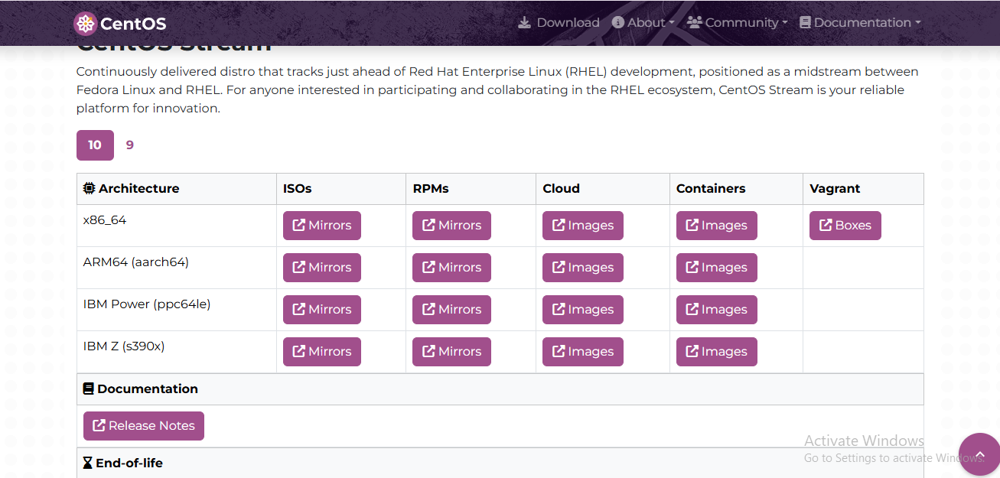
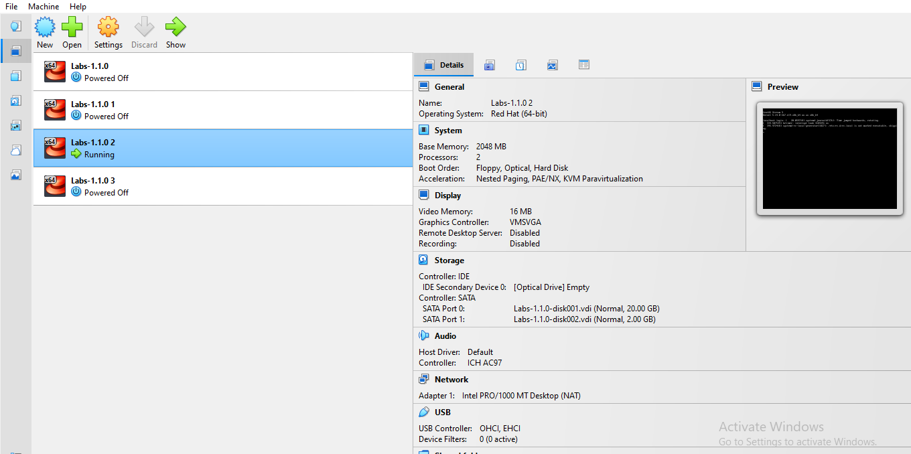
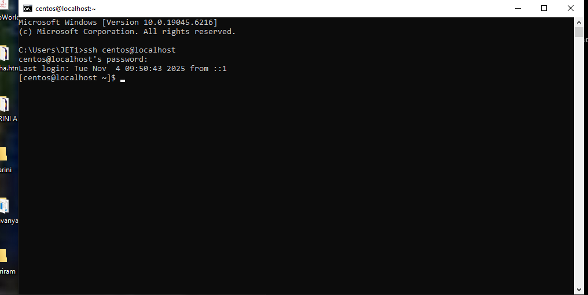

step 1:
first open the browser 
step 2:
enter the centos and download and open the app

step 3:
go the add the commant in the linux but first to link between the CMD

step 4:
link the CMD and linku centos

this is the final step to link the CMD and linux
step 5:
this is the end of the folder
